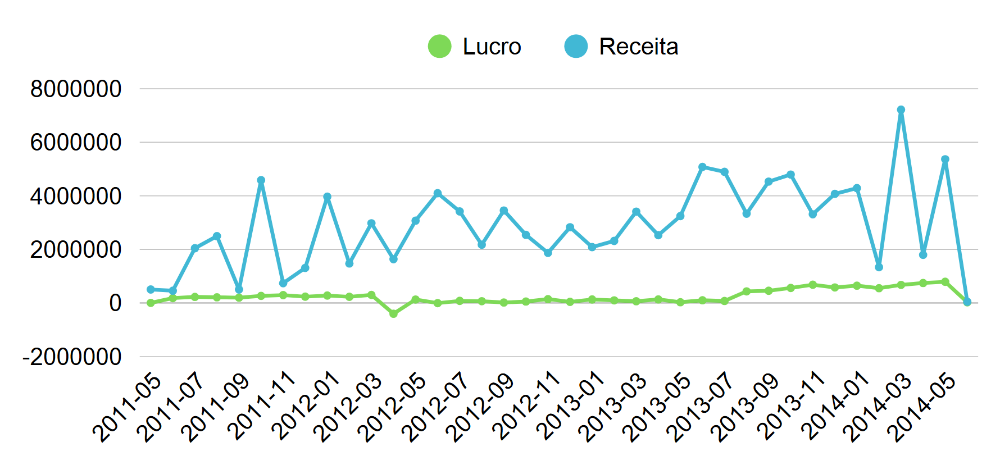
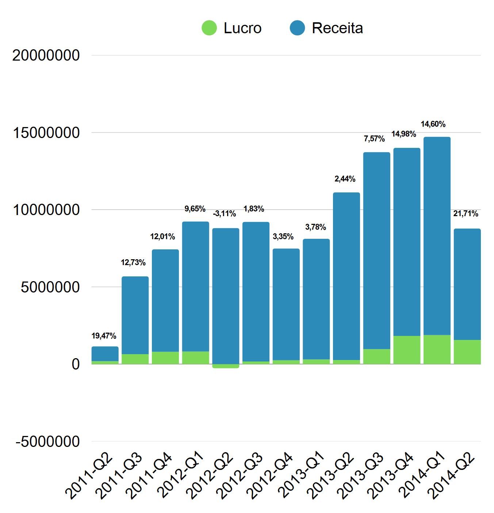
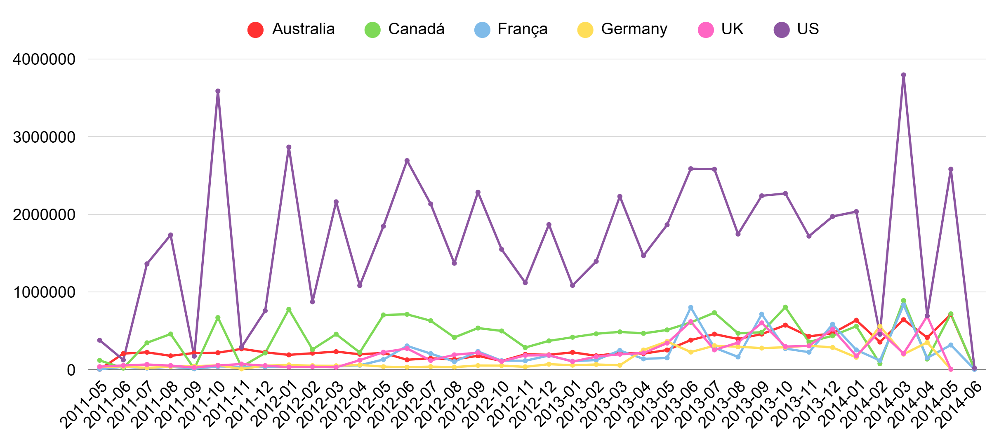
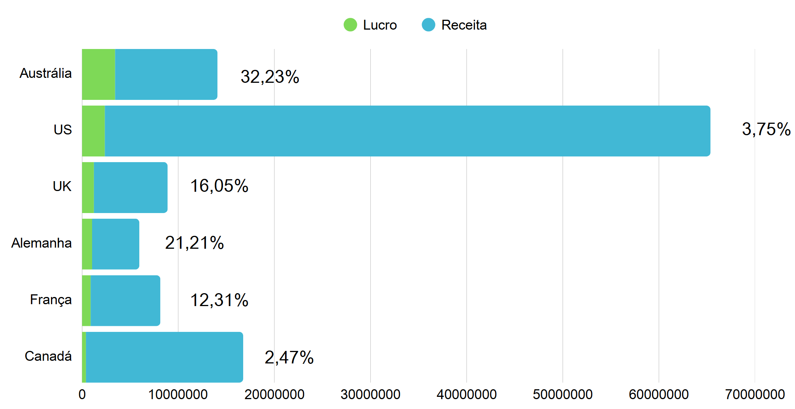
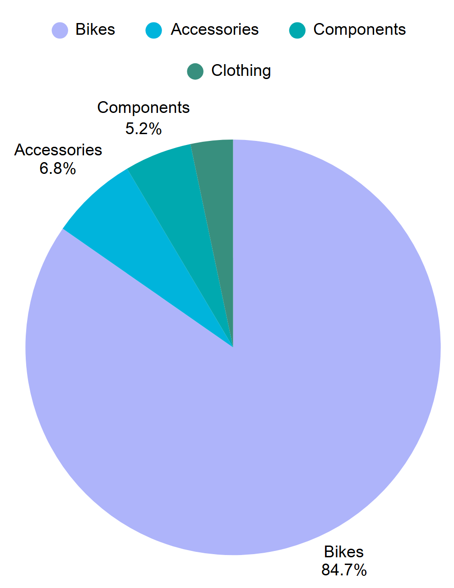
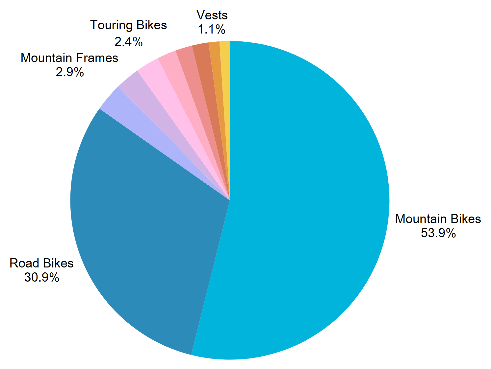

# AdventureWorks Sales Analysis 

This project analyzes sales performance using the AdventureWorks dataset by building an analytical table through SQL joins, validating data quality, and generating key business insights related to revenue, profit, seasonality, product categories, and regional performance.

---

## Objectives
- Build a clean analytical dataset from multiple AdventureWorks tables  
- Analyze revenue, profit, and margin trends  
- Detect seasonality (monthly & quarterly performance)  
- Identify top products, categories, and subcategories  
- Evaluate country and state-level performance  
- Analyze customer acquisition patterns  

---

## Tools
- **SQL Server** – data extraction, cleaning and transformation  
- **Excel / PowerPoint** – supporting analysis and presentation  

---

## 📁 Repository Structure

code/ → SQL queries
report/ → PDF & PowerPoint (findings summary)
image/ → Report graphs

---

## Data Preparation (SQL)
A consolidated panel (#panel_Project) was created using:

- SalesOrderDetail + SalesOrderHeader  
- Product, ProductSubcategory, ProductCategory  
- Address, StateProvince, CountryRegion  

Key calculated fields:
- UnitProfit = (UnitPrice × (1 - Discount)) – StandardCost  
- Revenue = LineTotal  
- Profit = Revenue – (StandardCost × Qty)  

Quality checks performed:
- Null values per column  
- Duplicated keys  
- Negative or zero quantities/prices  
- Date consistency  
- Category/subcategory inconsistencies  

---

## Main Insights
- Unclear seasonality, with revenue and profit peaking in specific months  
- Quarterly analysis shows stable growth and consistent profit margins  
- New customers grow steadily over time  
- Strong performance in countries such as United States, Canada, and Australia    
- Bikes and their subcategories contribute strongly to total profit  
- Most profitable subcategories and most sold subcategories differ, showing varied customer behavior  

---

## Visuals 
###AdventureWorks Revenue and Profit

###AdventureWorks Quarterly Revenue and Profit

###AdventureWorks Revenue per Country

###AdventureWorks Total Revenue per Country

###AdventureWorks Most Profitable Categories

###AdventureWorks Most Profitable Subcategories

